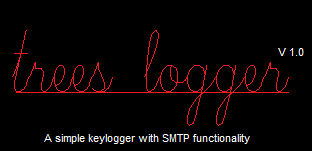

# Trees Logger 
**A simple keylogger with SMTP functionality**

### Installation
Treeslogger needs colorama and pynput.
`pip3 install colorama, pynput`

You will also require a gmail address and password.
Your gmail will need to enable access to less secure apps.
To do this log in to your email and head over to:
`myaccount.google.com/security`
Scroll down to "*Less Secure Apps Access*" and enable.
Thats it! You're ready to go.

### Useage
You can start the keylogger by running:
`python3 ./trees-logger.py`
Enter your Gmail address and password. (this will send the logged keystrokes)
Enter an email you want to receive the logs on.
And you're good to go! The listener will be started and you will be logging keys.
To stop the listener, press Ctrl & C. This will also trigger sending the email.

### Source Libs
* Python:	https://www.python.org/downloads/
* Pynput:	https://pypi.org/project/pynput/
* Colorama:	https://pypi.org/project/colorama/
* Email:	https://docs.python.org/3/library/email.html
* Smtplib:	https://docs.python.org/3/library/smtplib.html
* Ssl:		https://docs.python.org/3/library/ssl.html

### To Do
- [x] Include SMTP functionality
- [ ] Clean up code (Banner, SMTP Process)
- [ ] Check cross platform functionality (Tested on Linux Mint 20 Ulyana)
